AWS Management Console에서 [Amazon SageMaker](https://ap-northeast-2.console.aws.amazon.com/sagemaker/home?region=ap-northeast-2#/)를 검색합니다.
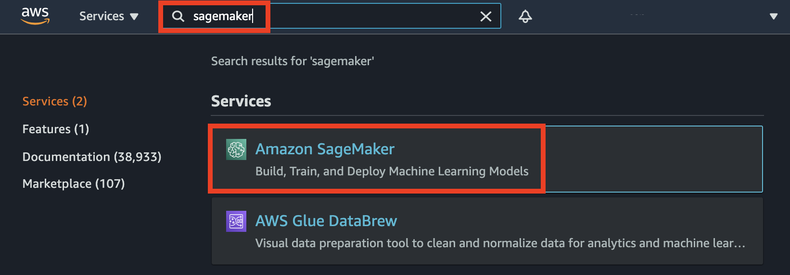

---

## Region 선택하기 

{}
Amazon SageMaker Notebook Instance와 S3 buckect이 동일한 리전에 있도록 생성합니다. 
{}

본 실습에서는 **Asia Pacific (Seoul) ap-northeast-2** region을 선택합니다. 그 후, 좌측 패널에서 **Notebook > Notebook instances** 탭을 클릭합니다.
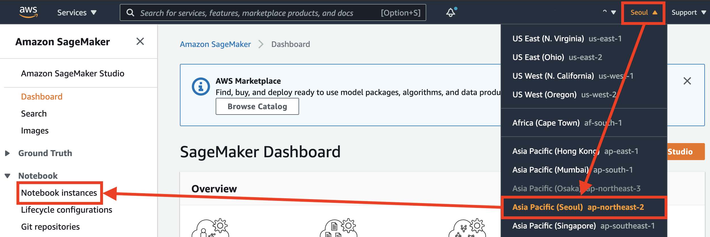

---

## SageMaker Notebook Instance 생성하기

1. 우측 상단의 **Create notebook instance** 버튼을 클릭합니다.
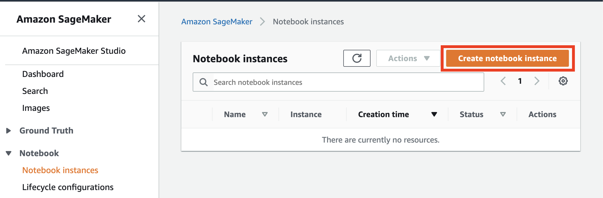

2. Notebook instance 이름을 `sagemaker-notebook-workshop`으로 작성합니다.
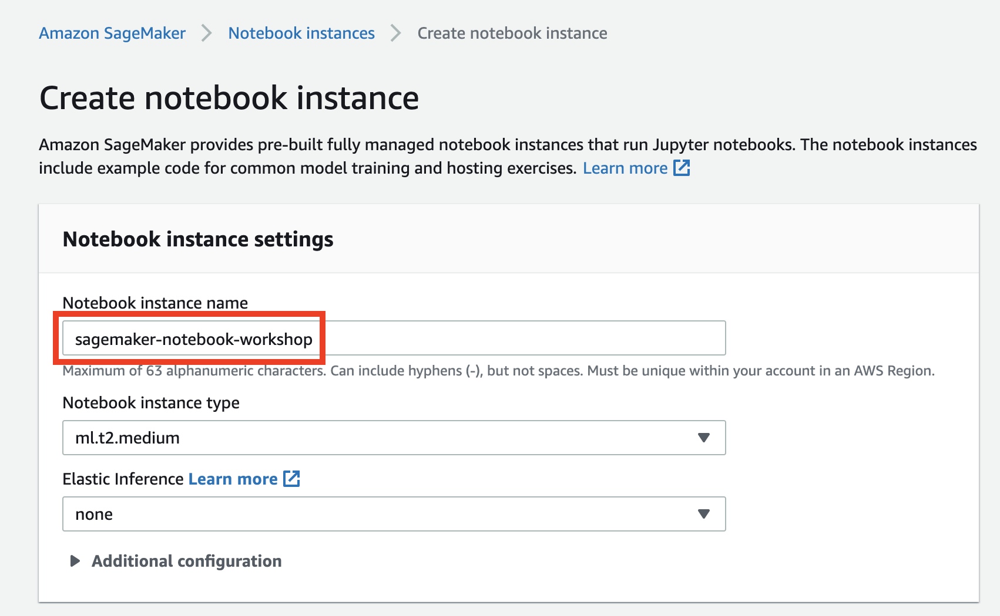

3. Permissions and encryption 에 있는 **IAM role**에서는 **Create a new role** 을 선택합니다.
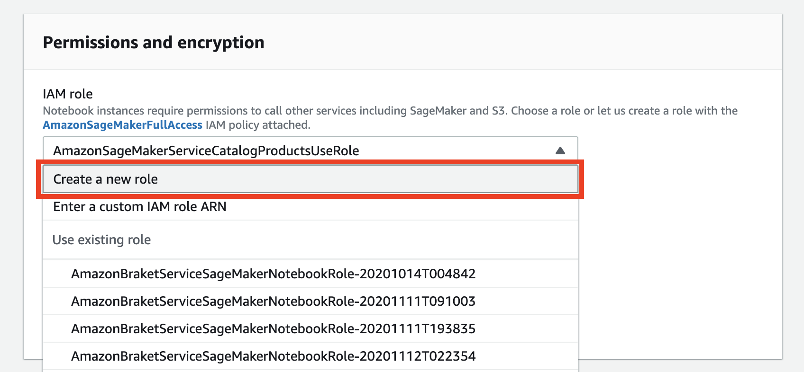

4. 모두 기본 설정으로 두고, **Create role** 버튼을 클릭합니다.
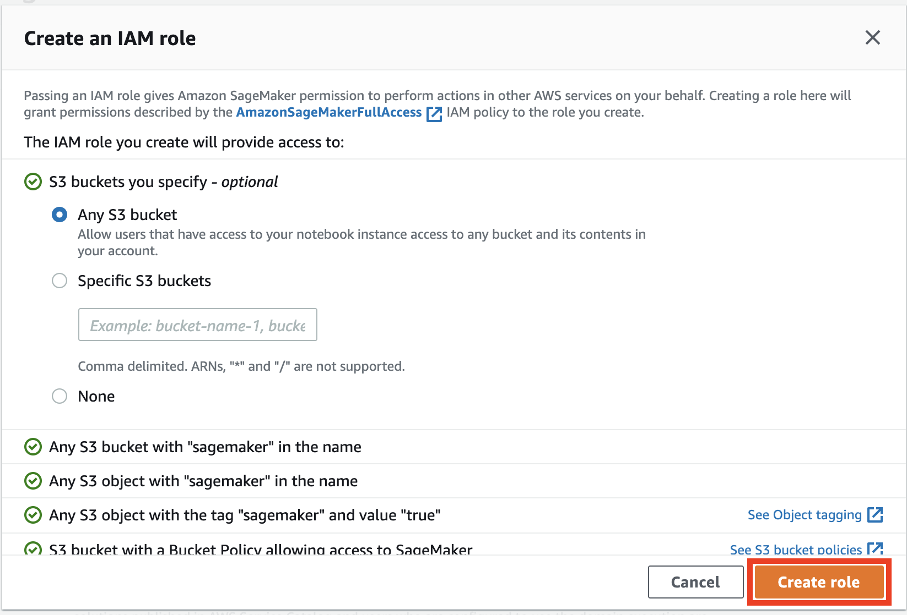

5. IAM role이 생성된 것을 확인하고 **Create notebook instance** 버튼을 클릭합니다.
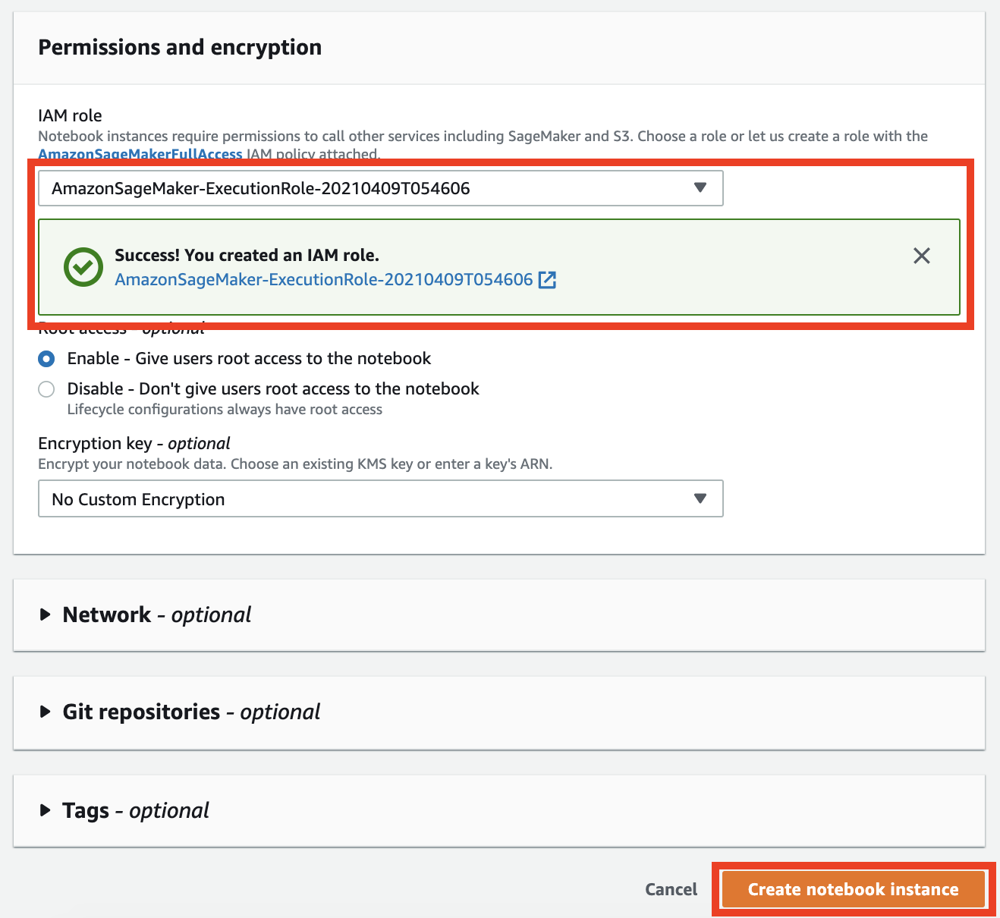

6. Instance의 **Status**가 **InService**로 바뀔때까지 기다립니다. 대략 3-5 분이 소요됩니다.
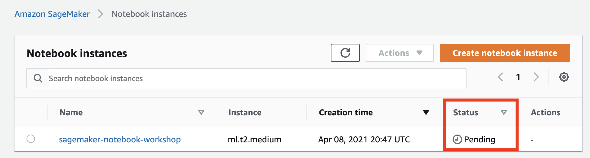
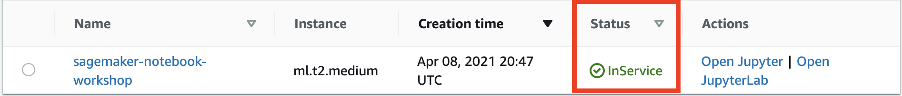

7. **Open Jupyter** 버튼을 클릭합니다.
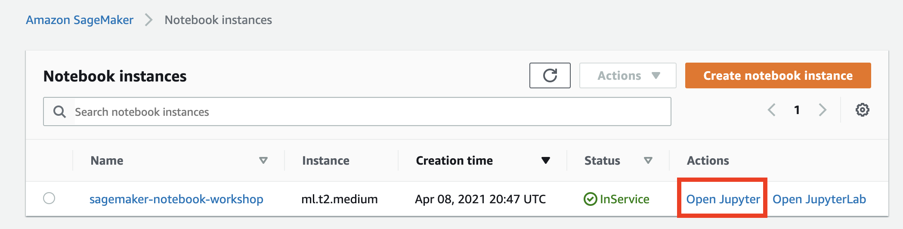

8. Notebook instance의 Jupyter 홈페이지로 이동합니다.                        
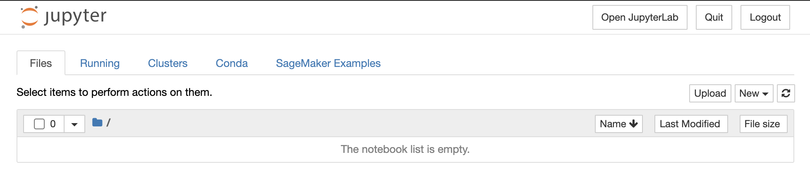
---

© 2021 Amazon Web Services, Inc. 또는 자회사, All rights reserved.
